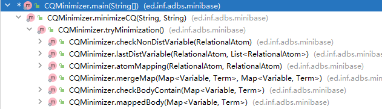

# readme

## **Minibase Project**

@Author: Shuren Miao

This is the coursework of ADBS (Advanced Database System) provided at the University of Edinburgh. In this coursework , the implementation includes a query minimizer and Minibase query processor for conjunctive querie.

## **Task 1 CQ Minimizer**

- Minimization of conjunctive queries

The query is thrown into a minimization loop after pre-processing. In each round, the query is tried to be reduced until the minimization.

1. To find a query homomorphism, a qualified atom is selected and tested whether this atom can be mapped into another atom.
2. Add all possible Atom-to-Atom mapping to candidate list.
3. Try to merge single mappings and apply this bigger mapping to all body atoms and get a new body.
4. If all atoms in the new body is contained in the previous body, this query homomorphism is qualified and replace the old body with new one.
5. Repeat.
- Functionality Methods Calling Hierarchy (utility methods are hiden)



- Test
  
    All given tests are passed, though there is a trivial problem that the ouput sequence might be different with the expected output.
    
    ```java
    "D:\Program Files\Java\jdk-14.0.2\bin\java.exe" com.intellij.rt.junit.JUnitStarter -ideVersion5 -junit4 ed.inf.adbs.minibase.CQMinimizerTest
    1: -----------------------
    match: false
    input: Q(x, y) :- P(x, y, z), R(x, a), S(y, w, x), P(x, y, a), S(a, a, x), S(y, y, x), R(x, z)
    output: Q(x, y) :- P(x, y, a), R(x, a), S(y, y, x), S(a, a, x)
    expect: Q(x, y) :- R(x, a), P(x, y, a), S(a, a, x), S(y, y, x)
    2: -----------------------
    match: true
    3: -----------------------
    match: true
    4: -----------------------
    match: true
    5: -----------------------
    match: true
    6: -----------------------
    match: true
    7: -----------------------
    match: true
    8: -----------------------
    match: true
    9: -----------------------
    match: true
    10: -----------------------
    match: true
    11: -----------------------
    match: true
    12: -----------------------
    match: false
    input: Q(x, z) :- R(4, z), S(x, y), T(12, 'x'), R(u, z), R(u, z), S(x, 4),T(14, 'y')
    output: Q(x, z) :- R(4, z), S(x, 4), T(12, 'x'), T(14, 'y')
    expect: Q(x, z) :- R(4, z), T(12, 'x'), S(x, 4), T(14, 'y')
    13: -----------------------
    match: true
    14: -----------------------
    match: true
    15: -----------------------
    match: true
    16: -----------------------
    match: true
    17: -----------------------
    match: true
    
    Process finished with exit code 0
    ```
    

## **Task 2 CQ Processor**

- Minibase
  
    The main entrance of In-memory database system processing conjunctive queries. It just create singleton objects, Catalog and Interpreter instance, then call interpreter.dump() to start processing a query task.
    
- Catalog
  
    Catalog is a collection of static methods for Minibase tasks, designed in singleton pattern. It deals with db/input/output files.
    
- Interpreter
  
    This class takes the responsibility of interpreting schema and query from the given filepath and get an operator root from query planner, designed in singleton pattern. The constructor will interpret schema and query from the given filepath, translate implicit conditions both for single and join relations, remove constant comparison atoms, and create a query planner.
    
    - The method `selectExplicit()` is used to **extract implicit select comparison atoms** from the body. For each terms in every RelationalAtom, if it is a Constant, e.g. rewrite R(x, y, 4) to R(x, y, a) by introducing a new variable and add a new comparison atom a = 4.
    - The method `joinSelectExplicit()` is used to **extract implicit join comparison atoms** from the body.For each variable in every RelationalAtom, if there is another variable withsame name appearing in former RelationalAtom, then replace the former variablewith a new one, e.g. rewrite R(x, y, z), S(x, w) to R(x, y, z), S(a, w) by introducing a new variable a and add a new comparison atom x = a.
- Planner
  
    This class is to create Planner instance to generate query plan for given query, the query plan is a tree structure with operators as its node.
    
    The method `generateQueryPlan()` is to generate a query plan with the query information from Interpreter. For every relational atoms, scan (must have), select, join, then sumAgg, and project. The operators (except scan) will pass an if-condition test before applied. If applicable, the operator will be added to the root as the parent of child nodes.
    
    ```java
    Operator root = null;
    for(RelationalAtom ra: ras){
    
        // scan
        Operator scanOperator = new ScanOperator(ra);
    
        // select
        Operator selectOperator;
        List<Term> raTerms = ra.getTerms();
        relatedTerms.addAll(raTerms);
        relatedCAS = findRelatedCAS(raTerms);
        if(!relatedCAS.isEmpty()){
            selectOperator = new SelectOperator(scanOperator, relatedCAS);
        }else {
            selectOperator = scanOperator;
        }
    
        // join
        Operator joinOperator;
        if(ras.indexOf(ra) == 0){
            root = selectOperator;
        }else {
            relatedCAS = findRelatedCAS(relatedTerms);
            root = new JoinOperator(root, selectOperator, relatedCAS);
        }
    }
    // end of for
    // sumAgg
    if(sumAggregate != null){
        root = new SumAggOperator(root, sumAggregate);
    }
    
    // project
    if(!it.getDistVariables().equals(relatedTerms)){
        root = new ProjectOperator(root, it.getDistVariables(), sumAggregate);
    }
    ```
    
    The logic of building an operator root is
    
    
    
- base classes
    - Schema
      
        This class abstract the concept of schema. It contains a list of string which refers to the type of attributes. For convenience, its toString, hashcode and equals method are overridden. 
        
        - `private List<String> types;`
    - Tuple
      
        This class encapsulate the data of tuple, with corresponding schema and terms. The list of values, terms and the schema holds the actual value, variable names, value types in sequence. A HashMap mapping is for the convenience of finding the value with given variable name. For convenience, its toString, hashcode and equals method are overridden.
        
        - `private List<Object> values;`
        - `private List<Term> terms;`
        - `private Schema schema;`
        - `private HashMap<Term,Object> mapping;`
- operators
    - ScanOperator
      
        This class is to create ScanOperator instance to scan records from corresponding database csv files and create tuples, with a given RelationalAtom ra.
        
    - SelectOperator
      
        This class is to create SelectOperator instance to select tuples from its child operator, with given ComparisonAtoms.
        
    - JoinOperator
      
        This class is to create JoinOperator instance to merge tuples from two child operators, with given ComparisonAtoms, based on simple nested loop join.
        
    - SumAggOperator
      
        This class is to create SumAggOperator instance to get tuples from its child operator. It would calculate the sum value of aggregated variable, for each distinct group-by variables group.
        
    - ProjectOperator
      
        This class is to create ProjectOperator instance to get tuples from its child operator, project them on the given Variables. It maintains a list of tuples that has been returned to eliminate duplicates.
    
- Test
  
    All given tests are passed
    
    ```java
    "D:\Program Files\Java\jdk-14.0.2\bin\java.exe" com.intellij.rt.junit.JUnitStarter -ideVersion5 -junit4 ed.inf.adbs.minibase.base.CatalogTest
    1: true
    2: true
    3: true
    4: true
    5: true
    6: true
    7: true
    8: true
    9: true
    
    Process finished with exit code 0
    ```
    

## **Task 3 - Optimisation Rules**

- Optimize Constant ComparisonAtoms
  
    The method `optimizeComparisonAtoms()`  is called in the constructor of `Interpreter` to optimize the query by removing constant comparison atoms, if true, remove it, if false, simplify the query to get a null output (just leave the first relational atom and a 1=0 comparison atom).
    
- Apply proper ComparisonAtoms
  
    For every select and join operator, there will be a parameter of related ComparisonAtom list, generated by `findRelatedCAS(relatedTerms)` in `Planner` so that it will only deal with ComparisonAtoms that really matters (if the terms of ComparisonAtom appear in the given terms list). Also, this method will remove these related ComparisonAtoms from the global list to avoid repeated use in following iterations.
    
- Not Implemented Optimisation Rules
  
    There are some optimisation rules that comes up to me, but have not been achieved.
    
    - Merging predicates 1-100+50-150 ⇒ 1-150
    - Simplify complex predicates X = Y AND Y = 3 ⇒ X = 3 AND Y = 3
    - Projection pushdown